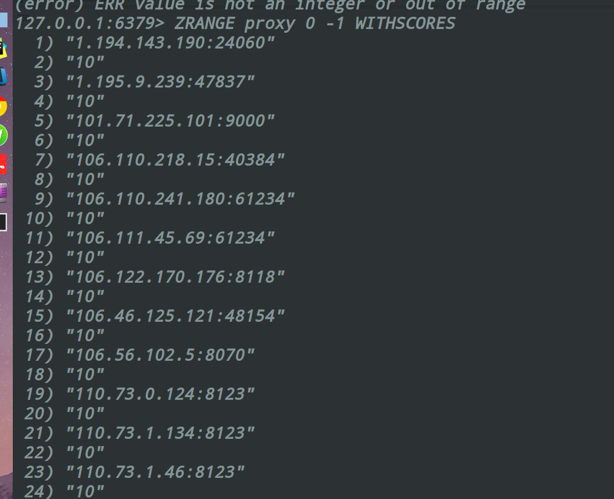

# ProxyPool

## 项目的整体架构
1. 获取模块
2. 检测模块
3. 存储模块
4. 接口模块

## Packages
* pipenv --three
* pipenv install

##  Python协程
[协程的讲解](http://python.jobbole.com/87310/)

## ScreenShot
### 抓取Ip

### 测试IP

### api-count

### api-random

